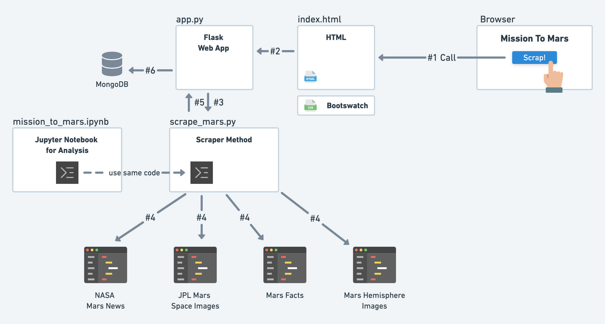

# web-scraping-challenge
A Web application that scraps data around Mars from 4 public sources, saves them to a MangoDB and presents them on a website using Flask and Jinja2 (see diagram below)

## Prerequisites:
1. Use MongoDB
2. Use PythonData38 environment
3. Use ChromeDriver chromedriver version for 95.0.4638 with Chrome version is 95.0.4638. If you don't, God help you.

